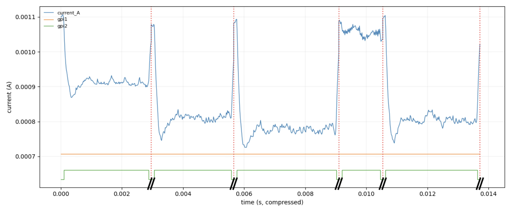

# Probabilistic Energy Consumption Modeling of MSP430 Programs

This project provides tools for modeling and predicting energy consumption of
MSP430FR5994 microcontroller programs using probabilistic methods.

## Setup

### 1. Install MSP430 GCC toolchain
We use the MSP430 GCC toolchain to compile C programs to MSP430 binaries.
Install and set the following environment variables:

- `MSP430GCC_TOOLCHAIN_PATH`: The path to the MSP430 GCC toolchain root directory (without `/bin` postfix).
  - Download "toolchain only" from [here](https://www.ti.com/tool/download/MSP430-GCC-OPENSOURCE/9.3.1.2)
that fits your platform.

- `MSP430GCC_SUPPORT_PATH`: The path to the MSP430 GCC support files root directory (without `/include` postfix).
  - Download "Header and Support Files" from
  [here](https://www.ti.com/tool/download/MSP430-GCC-OPENSOURCE/9.3.1.2). This is platform independent.

You can refer to `.env.sh.example` to set up your environment variables.

### 2. Install Julia Dependencies

This project uses Julia's package manager with `Project.toml` and `Manifest.toml` for reproducible dependency management.

First time setup:

```bash
julia --project=. -e 'using Pkg; Pkg.instantiate(); Pkg.precompile()'
```

### 2. Install Python Dependencies

Scripts for measuring and analyzing energy consumption are written in Python.
We use `uv` to manage Python dependencies.

Run `uv sync` to install the dependencies.

### 3. Set Otii (For energy measurement only)
We use Otii Ace Pro to measure energy consumption.

1. Install Otii Software from [here](https://www.qoitech.com/software/).
This will install Otii Software,
both GUI and CLI.

2. Buy Otii Automation Toolbox license from [here](https://www.qoitech.com/automation-toolbox/).

Otii requires to purchase a separate license to use the Automation Toolbox,
which is required to automate measurement through scripts.

3. Set the following environment variables:
- `OTII_SERVER_BIN`: The path to the Otii server binary.
    - In my Mac, it is installed at
    `/Applications/Otii 3.app/Contents/Resources/otii_server`
- `OTII_USERNAME`: Your Otii username (with Automation Toolbox license).
- `OTII_PASSWORD`: Your Otii password (with Automation Toolbox license).

4. Hardware setup:
    1. Connect both MSP430 and Otii Ace Pro
    to the host computer.
    2. Connect the voltage cables from Otii Ace Pro to MSP430 (black to GND, red to 3V3).
    3. Connect the GPI cables from Otii Ace Pro to MSP430 (GPI1 to P1.2, GPI2 to P1.3, and DGND to GND).

See [Physical setup](examples/images/physical-setup.jpg) for the physical setup.

Now we are ready to measure energy consumption.
We assume that the program uses `include/setup.h` to toggle GPI pins for
measurement.

A typical result of the measurement script is shown in the figure below:



## Usage

The main entrypoint is the Makefile.
Run `make help` for a list of available commands.

The main features include:
- `train`: Train the energy model from measurement data.
- `estimate`: Estimate energy consumption of a new program using the trained model.

## Testing

Run `make test` to run the test suite.

For now, we only have a few tests for the interpreter, which are done by
comparing the output of the interpreter to the output of the GDB interpreter.
