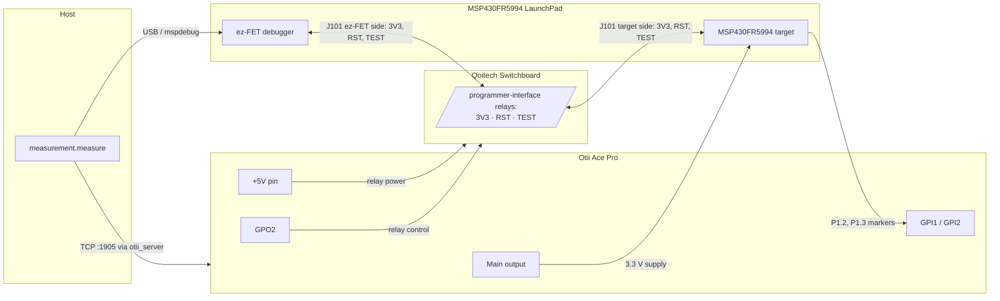

# Energy Measurement Setup

`pem analyze-distribution`, `pem train`, and `pem train-and-estimate` measure
an MSP430FR5994 powered by an Otii Ace Pro at a fixed voltage. This document is
the single source of truth for the setup's wiring and software.

## Hardware

- **Otii Ace Pro** — supplies the target on its main output, records current
  and power, drives the switchboard relays, and samples the program's GPIO
  markers on GPI1/GPI2.
- **Qoitech Switchboard** — its *programmer interface* (a pair of 10-pin
  headers whose relays switch pins 1/VCC, 2/SWDIO, 4/SWDCLK, 10/nRESET)
  connects and disconnects the ez-FET debugger's `3V3`, `SBW RST`, and
  `SBW TEST` lines. The target must be fully isolated from the debugger while
  it is measured. The switchboard's USB interface is **not** used: cutting host
  USB would only de-power the ez-FET while its pins stay on the target rails,
  and the target would leak through their ESD protection diodes.
- **MSP430FR5994 LaunchPad** — the on-board ez-FET stays on host USB the whole
  time; only its jumper lines to the target side are switched.

## Wiring Diagram

## Connections

| From | To | Notes |
|------|----|-------|
| Otii main output `+` | Board `3V3` rail | The measured supply |
| Otii main output `−` | Board `GND` | Common ground with everything below |
| Otii `+5V` pin | Switchboard relay power | Via the 14-pin expansion-port connector; relays are unpowered (open) when the Otii is off |
| Otii `GPO2` (expansion port) | Switchboard relay control | Jumper on the switchboard's 3-pin header set to the GPO2 side; high = relays closed |
| ez-FET `3V3` (J101 ez-FET side) | Programmer-interface IN pin 1 → OUT pin 1 → target `3V3` (J101 target side) | Switched (VCC relay) |
| ez-FET `RST`/SBWTDIO (J101 ez-FET side) | Programmer-interface IN pin 2 → OUT pin 2 → target `RST` | Switched (SWDIO relay) |
| ez-FET `TEST`/SBWTCK (J101 ez-FET side) | Programmer-interface IN pin 4 → OUT pin 4 → target `TEST` | Switched (SWDCLK relay) |
| LaunchPad `GND` jumper (J101) | — | Left mounted: ground stays common at all times, not routed through the switchboard |
| Host USB | ez-FET USB connector | Direct — the switchboard's USB interface is not used |
| Otii `GPI1` | MSP430 `P1.2` | High for the measured window |
| Otii `GPI2` | MSP430 `P1.3` | Event markers inside the window |
| Otii `DGND` | Board `GND` | |

On the LaunchPad's J101 isolation block, only the `GND` jumper stays mounted.
`3V3`, `RST`, and `TEST` are rerouted through the switchboard's 2.54 mm
programmer-interface header pair with jumper wires (pin numbers must match on
the IN and OUT headers; the pin-10 nRESET relay is unused here). All other
jumpers (`5V`, `RXD`, `TXD`) stay off — any line left connected can back-power
or leak current into the isolated target through pin protection diodes and
distort the measurement. A `DEBUG=1` build prints over the backchannel UART and
therefore needs `RXD`/`TXD` refitted; such a build must not be measured.

The target must never see both supplies at once: the runner keeps the Otii main
output off whenever the relays are closed.

`uv run python -m measurement.check_switchboard` verifies exactly that contract —
mspdebug must reach the target with the relays closed and fail with them open.

## How a Run Works

For each measured program:

1. **Flash** — relays closed (`GPO2` high), Otii main off, so the target runs
   on the ez-FET's 3V3. `mspdebug tilib` programs the ELF and the session is
   left open, which keeps the target halted under JTAG: it emits no GPIO
   markers yet.
2. **Isolate** — relays open while the target is still halted. It loses its
   only supply, and the mspdebug session dies with the cut SBW lines.
3. **Record** — the Otii recording starts while the target is still unpowered,
   then the main output is enabled. The program therefore starts from a clean
   power-on reset that cannot precede the recording; no start-up delay in the
   program is required.
4. **Export** — the recording is stopped at the first `GPI1` falling edge (the
   end of the measured window) and written as one CSV row per analog sample,
   with the `GPI1` level per sample and the `GPI2` edges aligned to the nearest
   sample. `measurement.preprocess` turns that into per-event segments.

After a run the relays are left open, so the ez-FET stays disconnected from the
target until the next run closes them.

## Software

1. Install the [Otii software](https://www.qoitech.com/download/) and an
   Automation Toolbox license, then export `OTII_SERVER_BIN`, `OTII_USERNAME`,
   and `OTII_PASSWORD` (the scripts start and stop `otii_server` themselves).
2. Install `mspdebug` with the TI library backend (`tilib`).
3. Install the Python dependencies: `uv sync`.
4. Measure, e.g.: `uv run pem analyze-distribution --files examples/misc/simple.c`.
