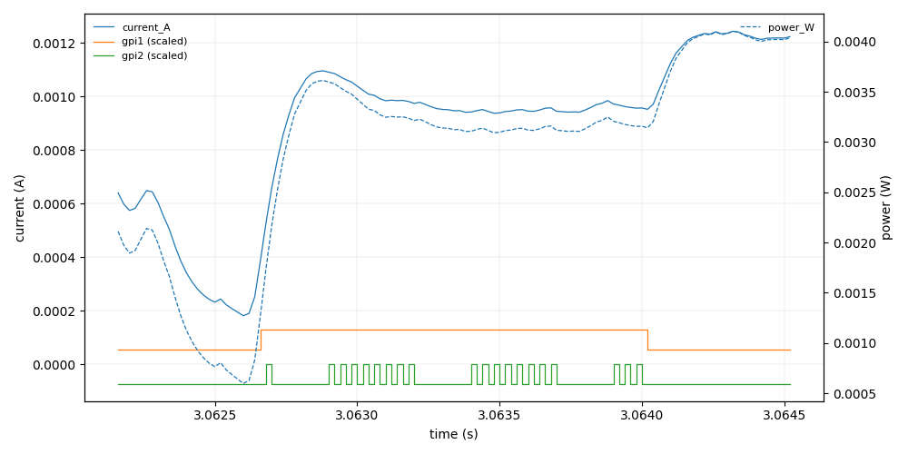

# Energy Measurement with Otii Ace Pro

## Overview

This repo provides two Python scripts:

1. **`measure.py`** — controls an Otii Ace Pro to record current & power while
your DUT runs, **using GPI1 to bound the measurement window** and **GPI2 for
event markers**. It exports a single CSV.

2. **`validate_and_plot.py`** — validates the CSV and **visualizes only the
GPI1-high window**, plotting current/power plus **GPI1/GPI2** digital traces (as
connected step graphs) with light downsampling for large files.

---

## Hardware connections

* **MAIN power**: DUT is powered from Otii Ace Pro `MAIN` at the voltage you set
* (`--voltage`).
* **Ground**: DUT ground **must** connect to **Otii DGND**.
* **GPI1 (digital input 1)**: Driven by the DUT as a **window marker**.

  * **High** = “measurement window is in progress”
* **GPI2 (digital input 2)**: Driven by the DUT as **event edges** during the window.

  * Edges are aligned to the nearest analog sample for the CSV column.

> Use **push-pull 3.3 V logic** on GPI pins. Avoid floating lines.

---

## Software requirements

* Python 3.9+
* Otii Automation Toolbox Python client: `otii-tcp-client`
* `python-dotenv`, `matplotlib`, `numpy` (for the viewer)
* Otii Ace Pro + valid Automation Toolbox license
* A target reset tool (default: `mspdebug` for MSP430; configurable)

Install:

```bash
python -m venv .venv && source .venv/bin/activate
pip install otii-tcp-client python-dotenv numpy matplotlib
```

---

## Configuration (.env)

Create a `.env` file in the project directory:

```ini
# path to the Otii server binary, if not set, the scripts will call `otii_server` from your PATH
OTII_SERVER_BIN=/path/to/otii_server
# The account must be licensed to use Otii Automation Toolbox
OTII_USERNAME=XXX
OTII_PASSWORD=XXX
```

---

## Script 1: Measurement (`measure.py`)

### What it does

* Starts `otii_server` automatically, waits until it is ready, and connects.
* Configures channels (`mc`, `mp`, `i1`, `i2`) and MAIN supply.
* Starts recording → enables MAIN → resets the DUT (unless `--skip_reset`).
* Waits for the first GPI1 falling edge using the recorded digital
* events, then stops.
* Exports a single CSV with:
  `timestamp_s, current_A, power_W, gpi1, gpi2`

  * `gpi1` — per-sample 0/1 level reconstructed from the sparse events
  * `gpi2` — sparse event values aligned to the nearest analog sample (`""`, `1` for rising, `0` for falling)

### Usage

```bash
# Basic run
python3 measure.py --voltage 3.3 --max_current 0.5 --outfile run.csv

# MSP430 reset via mspdebug (default). If your mspdebug auto-exits after one command,
# you can pass just 'reset':
python3 measure.py --reset_cmd "mspdebug tilib 'reset'"

# Skip reset if your firmware toggles GPI1 on its own
python3 measure.py --skip_reset

# Logging
python3 measure.py --log-level DEBUG --log-file measure.log
```

**Key options**

* `--voltage` (V) and `--max_current` (A) — MAIN supply
* `--outfile` — CSV path
* `--chunk` — export chunk size (rows per read), default `50_000`
* `--gpi_wait_timeout` — upper bound while waiting for the initial activity
* `--reset_cmd` — shell command to reset the DUT; change for non-MSP targets

> The script assumes **exactly one** Otii device connected. If your device requires a non-default current samplerate, uncomment the `set_channel_samplerate` line and pass `--sample_rate`.

---

## CSV format (output of `measure.py`)

| Column        | Description                                                                         |
| ------------- | ----------------------------------------------------------------------------------- |
| `timestamp_s` | Absolute timestamp in seconds                                                       |
| `current_A`   | Current from channel `mc`                                                           |
| `power_W`     | Power from channel `mp`                                                             |
| `gpi1`        | **Per-sample** digital level (0/1) reconstructed from sparse `i1` events            |
| `gpi2`        | **Sparse** edge markers aligned to the nearest sample: `""`, `1` (rise), `0` (fall) |

---

## Script 2: Validation & Visualization (`validate_and_plot.py`)

### What it does

* Streams the CSV to find the **first GPI1 0→1→0 window**.
* Loads **only the window** (with small pre/post margins).
* Reconstructs **GPI2 as a connected waveform** (step plot).
* Downsamples current/power for responsiveness.
* **Shows** the plot interactively (`plt.show()`).

### Usage

```bash
# Default: ±0.5 ms around the window, 20k max points per analog series
python3 validate_and_plot.py run.csv

# Tighter or looser margins
python3 validate_and_plot.py run.csv --pre-context 0.0003 --post-context 0.0004

# Control downsampling density
python3 validate_and_plot.py run.csv --max-points 15000
```

### Example



## Wiring 

TODO: Add image
